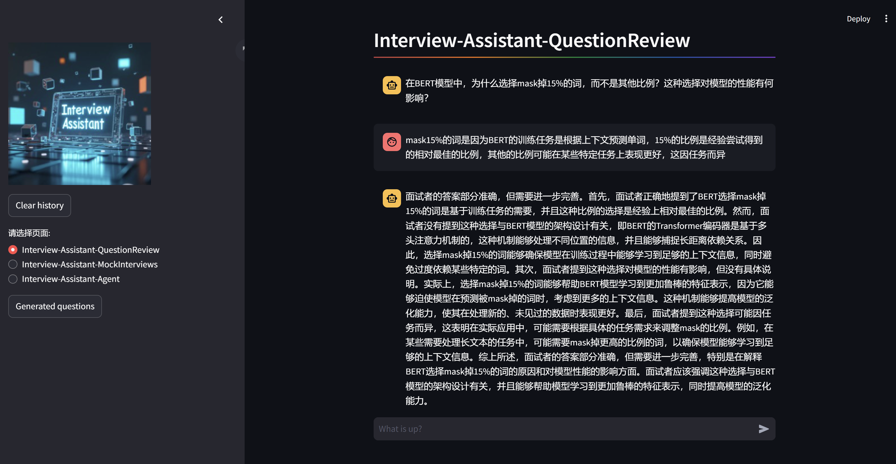
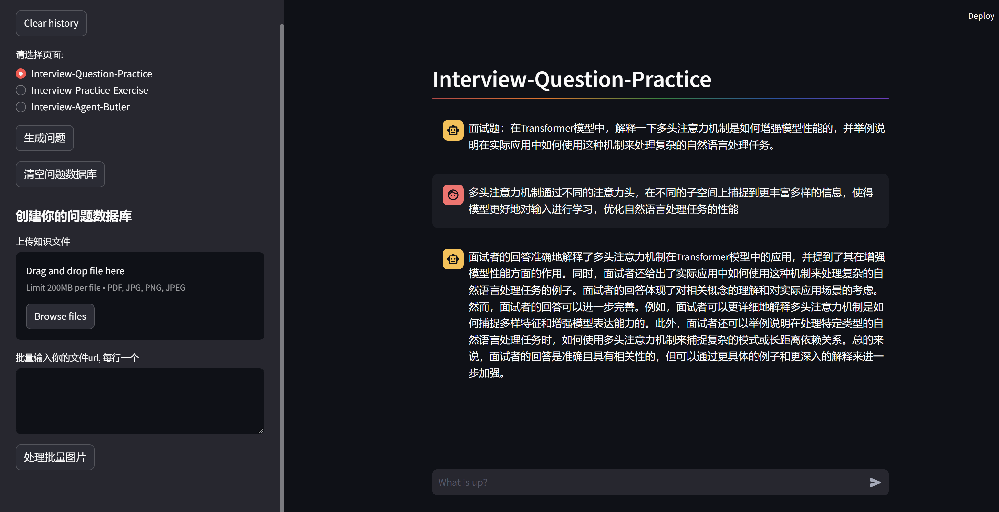
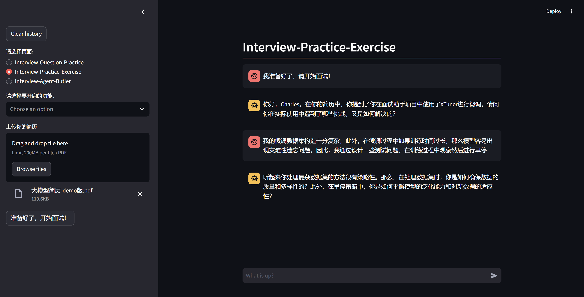
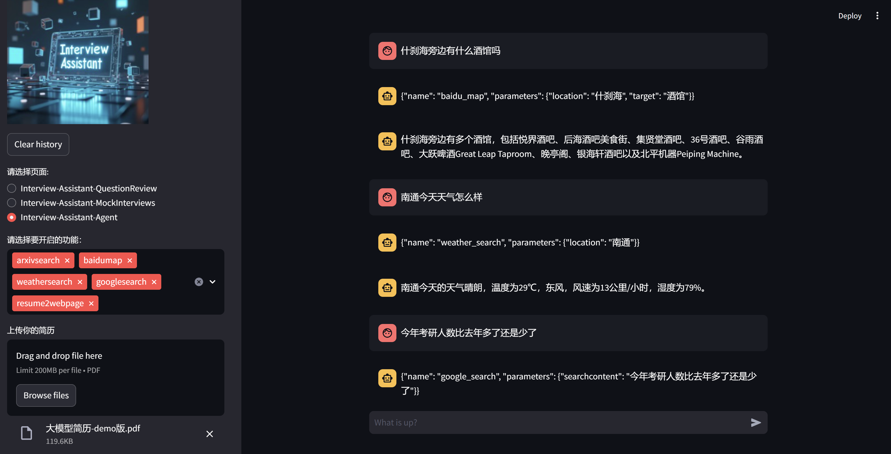
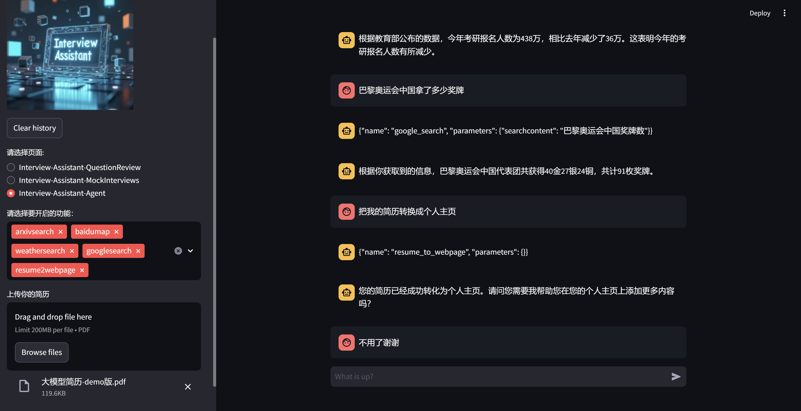
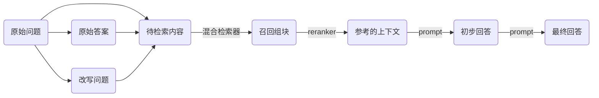
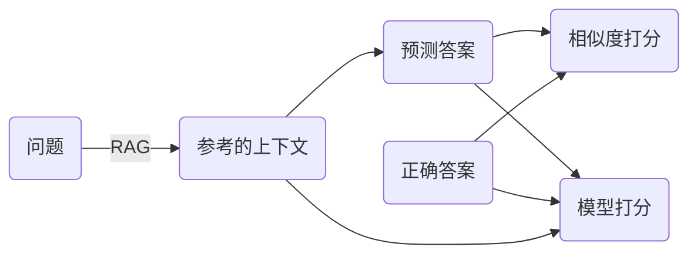
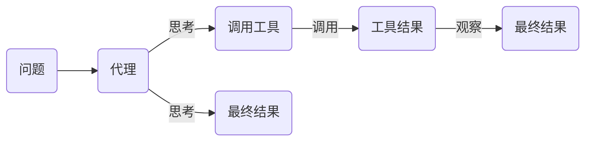

# InternLM-Interview-Assistant
基于InternLM的面试复习助手项目，欢迎大家也来参加书生大模型实战营项目[http://github.com/internLM/tutorial](http://github.com/internLM/tutorial)

当前版本的全部代码、微调数据集均开源，RAG数据集由于为本人面试复习整理的资料，仅供个人使用未开源，用户可自行安放个人知识资料。

# 架构图


# 效果 DEMO
- 上传知识文件(pdf、jpg、png)，生成面试题存入数据库，支持批量上传

- 抽取面试题，改写后提问，使用RAG评估答案

- 上传简历，模拟面试

- Agent功能（简历转个人主页尚未完善）


- 支持TTS、ASR，无效果图

# 快速使用

## 本地部署
```bash
git clone https://github.com/wuzhongyanqiu/InternLM-Interview-Assistant.git
cd InternLM-Interview-Assistant
conda env create -f environment.yml
conda activate interview-assistant
pip install -r requirements.txt
streamlit run app.py
```

## 前后端分离启动
- ASR服务：
```bash
uvicorn server.asr.asr_server:app --host 0.0.0.0 --port 8001
```
- TTS服务：
```bash
uvicorn server.tts.tts_server:app --host 0.0.0.0 --port 8002
```
- InternLM-Interview-Assistant服务：
```bash
uvicorn server.base.base_server:app --host 0.0.0.0 --port 8003
```
- RAG等工具的服务：
```bash
uvicorn server.tools.tools_server:app --host 0.0.0.0 --port 8004
```
- InternVL-Interview-Assistant服务：
```bash
lmdeploy serve api_server ./models/Internvl-Interview-Assistant --cache-max-entry-count 0.2 --backend turbomind --server-port 8005 --chat-template ./server/internvl/chat_template.json
```

对于 Interview-Assistant 服务，由于使用的是 LMdeploy 部署，其默认 kv-cache 缓存为剩余显存的0.8，这样在开启其他服务时会出现abort的情况，在此改为0.3。

当前快速使用方法的环境、路径等会出现冲突，待重构代码后更新方法。

# 流程

## 一、微调 InternLM2-chat-7b 和 InternVL2-2b
### 数据集构建
#### InternLM2-chat-7b

本项目当前版本的数据集采用个人整理总结的大模型面试相关数据和 ChatGLM & Qwen & Erniebot 的生成数据集，数据集格式如下：

- 多轮对话数据
```
[
    {
        "conversation": [
            {
                "system": "你是一个面试官，你能根据面试者的简历信息和对面试者进行面试，你一次最多提出一个问题，你的问题必须涉及具体的专业知识，你必须对面试者的回答给出反馈，并适当的反问，你说话简洁明了。",
                "input": "您好，面试官，我的简历内容是：\n个人信息：\n\n姓名:......,
                "output": "你好，Alice。首先，我想了解一下你在智能医疗数据分析平台项目中使用的机器学习算法是哪些？你在项目中的具体职责是什么？"
            },
            {
                "input": "您好，面试官。在智能医疗数据分析平台项目中，我们主要使用了逻辑回归、决策树和随机森林等机器学习算法.....",
                "output": "很好，你在数据预处理阶段使用的Pandas和NumPy工具对数据科学领域是非常基础且重要的技能。请问，在构建预测模型时，你是如何评估模型性能的？是否有使用特定的指标或者方法来确保模型的有效性？"
            },
            {
                "input": "在构建预测模型时，我采用了交叉验证的方法来评估模型性能。具体地，我使用了k折交叉验证...",
                "output": "你对模型评估方法的理解和应用已经非常到位了。在实践中，选择合适的模型评估指标非常重要，尤其是在面对不均衡类别的数据时。你提到的准确率、召回率和F1分数都是评估预测模型性能的有效指标......？"
            },
            {
                "input": "在金融风险评估系统项目中，我协助团队使用统计模型来评估投资组合风险....,
                "output": "你对金融风险评估系统的理解和应用显示了你在统计建模方面的深厚知识和实践经验....？"
            },
            {
                "input": "在我的科研经历中，我尝试将时间序列分析与机器学习技术结合来预测金融市场的波动性.....,
                "output": "你对科研过程中遇到挑战的描述显示了你在时间序列分析与机器学习结合应用方面有深入的思考和实践...."
            },
            {
                "input": "在科研过程中，我使用Pandas库来清洗数据、处理异常值和数据标准化.....,
                "output": "你对使用Pandas进行数据清洗、异常值处理和数据标准化的详细步骤展示了你对数据分析工具的实际操作能力....."
            }
        ]
    },
...
]
```
- 自我认知数据
```
[
    {
        "conversation": [
            {
                "input": "请介绍一下你自己",
                "output": "我是您的面试辅导助手，致力于协助您复习面试要点。我内置了上海AI实验室开发的书生·浦语7B大型语言模型，能够精准提取面试问题，并帮助您巩固相关知识，同时评估您的答案准确性。"
            }
        ]
    },
...
]
```
- 指令数据
```
[
    {
        "conversation": [
            {
                "system": "\n        你是一个可以调用工具的智能助手。请根据\"当前问题\"，调用工具收集信息并回复问题，你可以使用如下工具：\n\n        <|tool_start|>{{\"name\": \"arxivsearch\", \"description\": \"用于查找论文，输入论文关键词，返回查找到的论文结果\", \"parameters\": {{\"keyword\": 你要查找的论文关键字}}}}<|tool_end|><|tool_start|>{{\"name\": \"baidu_map\", \"description\": \"用于查找给定地点附近的酒店等\", \"parameters\": {{\"location\": 你要查找的地点, \"target\": 你要查找的内容}}}}<|tool_end|><|tool_start|>{{\"name\": \"weather_search\", \"description\": \"用于查找给定地点的当前实时天气\", \"parameters\": {{\"location\": 你要查找的地点}}}}<|tool_end|><|tool_start|>{{\"name\": \"google_search\", \"description\": \"用于使用搜索引擎搜索相关信息\", \"parameters\": {{\"searchcontent\": 你要搜索的内容}}}}<|tool_end|><|tool_start|>{{\"name\": \"resume_to_webpage\", \"description\": \"用于将简历转换成个人网页\", \"parameters\": {{}}}}<|tool_end|>\n\n        ## 回复格式\n\n        调用工具时，请按照以下格式：\n        ```\n        你的思考过程...<|action_start|><|plugin|>{\"name\": \"tool_name\", \"parameters\": {\"param1\": \"value1\"}}<|action_end|>\n        ```\n\n        当你已经调用工具获取到信息时，直接回答问题！\n        注意你可以使用的工具，不要随意捏造！\n        如果没有可以使用的工具，按照原本的知识进行回答！\n        ",
                "input": "首都国际机场周边有哪些手表制造厂？",
                "output": "{\"name\": \"baidu_map\", \"parameters\": {\"location\": \"首都国际机场\", \"target\": \"手表制造厂\"}}"
            }
        ]
    },
    {
        "conversation": [
            {
                "system": ...,
                "input": "何时爱姬生下了八姬五郎？",
                "output": "{\"name\": \"google_search\", \"parameters\": {\"searchcontent\": \"爱姬何时生下八姬五郎\"}}"
            }
        ]
    },
]
```
#### InternVL2-2b

本项目当前版本的数据集采用个人整理总结的面试相关图片和 GLM-4V 生成的数据，数据集格式如下：

- 指令数据
```
[
    {
        "image": "./pics/pic363.png",
        "conversations": [
            {
                "from": "human",
                "value": "<image>\n将图里的信息提取出几道面试题，每道面试题必须以<|start|>开始，并且以<|end|>结束"
            },
            {
                "from": "gpt",
                "value": "<start>面试题1：卷积神经网络中的步长（Stride）和零填充（Zero Padding）有什么区别？<end>\n<start>面试题2：在卷积神经网络中，如何选择合适的步长（Stride）和零填充（Zero Padding）参数？<end>"
            }
        ]
    },
    {
        "image": "./pics/pic364.png",
        "conversations": [
            {
                "from": "human",
                "value": "<image>\n将图里的信息提取出几道面试题，每道面试题必须以<|start|>开始，并且以<|end|>结束"
            },
            {
                "from": "gpt",
                "value": "<start>面试题1：请解释卷积运算在图像处理中的基本概念和作用？<end>\n<start>面试题2：如何理解卷积核的性质及其对特征提取的影响？<end>"
            }
        ]
    },
    ...
]
```

### 训练和部署
#### InternLM2-chat-7b
1. 将`./finetune/internlm2_chat_7b_qlora_interview_data.py`中的数据集路径和模型路径替换为本地路径，其余参数根据需求和资源调整。
2. 使用命令进行训练，自定义评估问题，可以手动早停：
```
xtuner train ./finetune/internlm2_chat_7b_qlora_interview_data.py --deepspeed deepspeed_zero2
```
3. 转换模型为hf格式：
```
export MKL_SERVICE_FORCE_INTEL=1
export MKL_THREADING_LAYER=GNU
xtuner convert pth_to_hf ./finetune/internlm2_chat_7b_qlora_interview_data.py \
                         ./work_dirs/internlm2_chat_7b_qlora_interview_data/iter_250.pth \
                         ./work_dirs/internlm2_chat_7b_qlora_interview_data/iter_250_hf
```
4. 合并模型：
```
xtuner convert merge ./models/internlm2-chat-7b ./work_dirs/internlm2_chat_7b_qlora_interview_data/iter_250_hf ./work_dirs/internlm2_chat_7b_qlora_interview_data/iter_250_merge --max-shard-size 2GB
```
5. Imdeploy部署-可选
```
pip install lmdeploy
python -m lmdeploy.pytorch.chat ./work_dirs/internlm2_chat_7b_qlora_interview_data/iter_250_merge  \
    --max_new_tokens 256 \
    --temperture 0.8 \
    --top_p 0.95 \
    --seed 0
```
6. 进行4bit量化-可选
```
lmdeploy lite auto_awq ./work_dirs/internlm2_chat_7b_qlora_interview_data/iter_250_merge --work-dir ./work_dirs/internlm2_chat_7b_qlora_interview_data/iter_250_merge_4bit
```
7. 测试速度-可选
```
python ./benchmark/benchmark_transformer.py
python ./benchmark/benchmark_lmdeploy.py 
```
得到速度对比，可以看到使用LMdeploy的Turbomind和4bit量化模型可以明显提升推理速度。
||||
|-|-|-|
|Model|Toolkit|speed(words/s)
InternLM-Interview-Assistant|transformer|66.378
InternLM-Interview-Assistant|LMDeploy(Turbomind)|145.431
InternLM-Interview-Assistant-4bit|LMDeploy(Turbomind)|343.990

#### InternVL2-2b
1. 将`./finetune/internvl_v2_internlm2_2b_qlora_finetune.py`中的数据集路径和模型路径替换为本地路径，其余参数根据需求和资源调整。
2. 使用命令进行训练：
```
NPROC_PER_NODE=1 xtuner train ./finetune/internvl_v2_internlm2_2b_qlora_finetune.py --work-dir ./work_dirs/internvl_v2_internlm2_2b_qlora/internvl_ft_run_8_filter --deepspeed deepspeed_zero1
```
3. 合并模型
```
python3 ../XTuner/xtuner/configs/internvl/v1_5/convert_to_official.py ./finetune/internvl_v2_internlm2_2b_qlora_finetune.py ./work_dirs/internvl_v2_internlm2_2b_qlora/internvl_ft_run_8_filter/iter_{?}.pth ./models/InternVL2-2B/
```

## 二、RAG检索增强生成
此处的RAG知识分块仅针对pdf，采取不同粒度的切分，切分长度大小可调整，目前是适合我个人知识库的大小，有关其他格式的文件代码后期会补

- 检索器构建

此处的检索器构建利用langchain的BM25Retriever和FaissRetriever，向量模型分别用的是m3e、gte、bge、bce，采取多路召回模式


- RAG过程

rerank模型分别使用bge、bce



- RAG评估

这里使用自动评分（text2vec相似度分数，权重0.6）和模型评分（GLM4主观评分，权重0.4）进行综合评估。



评估的问答对格式如下，有正确答案和无答案比例为5:1左右：
```
[
    {
        "question": "\n解释LangChain框架的主要功能及其对开发人员在处理语言模型时的优势。\n",
        "answer": "\nLangChain框架主要提供了一套工具和接口，使开发人员能够更有效地利用语言模型构建端到端的应用程序...\n"
    },
    {
        "question": "巴黎奥运会中国拿了多少个奖牌",
        "answer": "无答案"
    },
    ...
]
```

知识库中的相关文档页数和不相关文档页数比例为34:435，以此添加噪声，测试RAG性能。

最终RAG得分为：
|-|-|
|自动评分|模型评分|
|0.893||

## 三、Agent智能体

Agent智能体代码需要修改，当前效果有很大优化空间。



实现如下Agent功能：
- 搜索引擎：利用搜索引擎回答问题
- 实时天气：查询某个地点实时天气
- 地点周边：查询某个地点的周边环境
- 论文搜索：arxiv论文搜索
- 主页生成：根据简历生成个人主页

## 四、计划
- 重构代码
- 数据集优化
- 微调模式
- agent指令微调
- function call
- 数字人
- 语音文本的中英文夹杂优化
- 偏好对齐
- 模型评估
- 知识图谱
- 安卓端部署
- 语音交流-QwenAudio
- 解析视频-基于InternVL
- 更大基座模型

## 五、后记
本项目是个人的一个学习项目，由于刚刚起步，因此整个项目的架构都还不明晰，很多东西都有优化空间，效果和理想的有差距，比如在回答问题时如果说不知道，模型会出现复读机问题。

随着本人能力的不断迭代和花费的时间不断增多，此项目也会随之优化，期望其能变成一个完整的、有意义的项目。

作为一个刚入行几个月的新手，把学到的知识利用起来，转换为自己的兴趣是很有意义的事情，非常感谢上海人工智能实验室主办的书生大模型实战营，为本人做一个属于自己的开源项目提供了丰富的算力和技术支持，非常感谢！