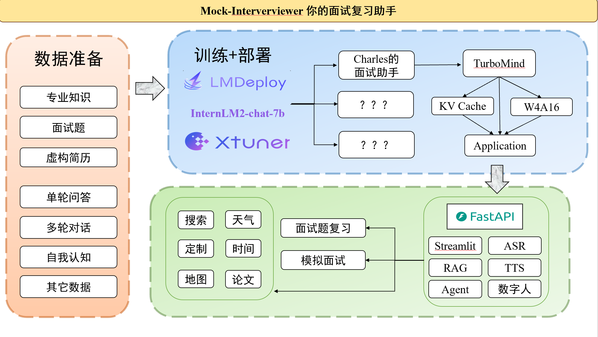
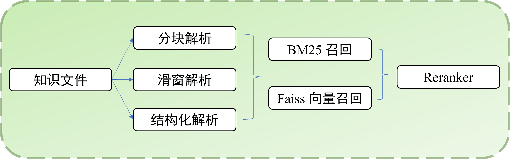
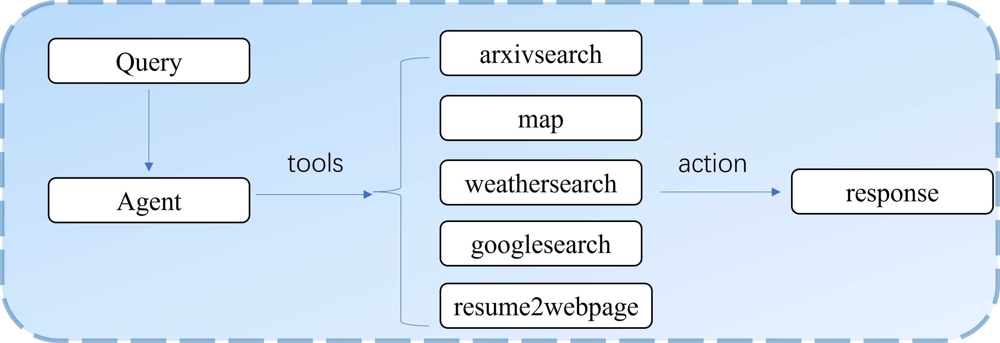

# InternLM-Mock-Interviewer
基于InternLM的模拟面试官项目，欢迎大家也来参加书生大模型实战营项目[http://github.com/internLM/tutorial](http://github.com/internLM/tutorial)

# 架构图


# Demo
## 面试题复习
## 模拟面试
## Agent助手

# 使用说明
该项目的一站式使用正在构建中，当前代码过于乱还没来得及重构

# 流程

## 一、微调intern2
### 数据集构建
本项目当前版本的数据集采用个人整理总结的大模型面试相关数据和ChatGLM & Qwen & Erniebot的生成数据集，当前开源了全部数据生成、处理方式和生成数据集，数据集格式如下：
- 单轮对话数据
```
[
    {
        "conversation": [
            {
                "input": "面试题是：\"LangChain 框架的主要功能是什么...\", 面试者给出的的答案是: LangChain框架的主要功能是链接语言模型和外部资源，比如私有数据和实时信息...",
                "output": "面试者的答案基本抓住了LangChain框架的核心概念，但存在一些需要澄清和纠正的地方..."
            }
        ]
    },
...
]
```
- 多轮对话数据
```
[
    {
        "conversation": [
            {
                "system": "你是一个面试官，你能根据面试者的简历信息和对面试者进行面试，你一次最多提出一个问题，你的问题必须与简历内容相关，注意，如果简历中有一些专业名词，你可以直接问面试者相关内容，面试者的每个回答你都会给予反馈，然后追问或继续抛出问题，你的话语要简洁，不超过100字。",
                "input": "您好，面试官，我的简历内容是：\n个人信息：\n- 姓名：Charles\n- 联系方式：123-4567-8900\n- 邮箱：Charles399@163.com...",
                "output": "你好，Charles。首先，能简单介绍一下你在开发基于大模型的面试模拟工具时遇到的主要挑战吗？"
            },
            {
                "input": "当然，我在开发面试模拟工具时遇到的主要挑战是确保模型能准确模拟真实面试场景...。",
                "output": "很好，你在科研经历中提到的低存储伴随晶格玻尔兹曼方法听起来很专业。请问这个方法..."
            },
            ...
        ]
    },
...
]
```
- 自我认知数据
```
[
    {
        "conversation": [
            {
                "input": "请介绍一下你自己",
                "output": "我是您的面试辅导助手，致力于协助您复习面试要点。我内置了上海AI实验室开发的书生·浦语7B大型语言模型，能够精准提取面试问题，并帮助您巩固相关知识，同时评估您的答案准确性。"
            }
        ]
    },
...
]
```
### 训练和部署
1. 将`./finetune/internlm2_chat_7b/internlm2_chat_7b_qlora_interview_data.py`中的数据集路径和模型路径替换为本地路径，根据显存大小调整`max_length`或`batch_size`，根据数据量和训练的效果调整`lr`等其他参数。
2. 使用命令进行训练，自定义评估问题，可以手动早停：
```
xtuner train finetune/internlm2_chat_7b_qlora_interview_data.py --deepspeed deepspeed_zero2
```
3. 转换模型为hf格式：
```
export MKL_SERVICE_FORCE_INTEL=1
export MKL_THREADING_LAYER=GNU
xtuner convert pth_to_hf ./finetune/internlm2_chat_7b_qlora_interview_data.py \
                         ./work_dirs/internlm2_chat_7b_qlora_interview_data/iter_250.pth \
                         ./work_dirs/internlm2_chat_7b_qlora_interview_data/iter_250_hf
```
4. 合并模型：
```
xtuner convert merge ./models/internlm2-chat-7b ./work_dirs/internlm2_chat_7b_qlora_interview_data/iter_250_hf ./work_dirs/internlm2_chat_7b_qlora_interview_data/iter_250_merge --max-shard-size 2GB
```
5. Imdeploy部署-可选
```
pip install lmdeploy
python -m lmdeploy.pytorch.chat ./work_dirs/internlm2_chat_7b_qlora_interview_data/iter_250_merge  \
    --max_new_tokens 256 \
    --temperture 0.8 \
    --top_p 0.95 \
    --seed 0
```
6. 进行4bit量化-可选
```
lmdeploy lite auto_awq /root/Mock-Interviewer/work_dirs/internlm2_chat_7b_qlora_interview_data/iter_250_merge --work-dir /root/Mock-Interviewer/work_dirs/internlm2_chat_7b_qlora_interview_data/iter_250_merge_4bit
```
7. 测试速度-可选
```
python ./benchmark/benchmark_transformer.py
python ./benchmark/benchmark_lmdeploy.py 
```
得到速度对比，可以看到使用LMdeploy的Turbomind和4bit量化模型可以明显提升推理速度。
||||
|-|-|-|
|Model|Toolkit|speed(words/s)
mock-interviewer-7b|transformer|66.378
mock-interviewer-7b|LMDeploy(Turbomind)|145.431
mock-interviewer-7b-4bit|LMDeploy(Turbomind)|343.990

## 二、RAG检索增强生成



使用向量召回、文本召回的两路召回模式，对召回组块进行重排序，构建新的`prompt`，使回答更加具有可解释性，契合个人回答的风格

## 三、Agent智能体



实现如下Agent功能：
- 搜索引擎：利用搜索引擎回答问题
- 实时天气：查询某个地点实时天气
- 地点周边：查询某个地点的周边环境
- 论文搜索：arxiv论文搜索
- 主页生成：根据简历生成个人主页

## 四、其他功能
- TTS
- ASR
- 数字人

## 五、前后端分离
- ASR服务：
```bash
uvicorn server.asr.asr_server:app --host 0.0.0.0 --port 8001
```
- TTS服务：
```bash
uvicorn server.tts.tts_server:app --host 0.0.0.0 --port 8002
```
- Mock-Interviewer服务：
```bash
uvicorn server.base.base_server:app --host 0.0.0.0 --port 8003
```
- RAG等工具的服务：
```bash
uvicorn server.tools.tools_server:app --host 0.0.0.0 --port 8004
```

## 六、计划
- 重构代码
- 数据集优化
- 偏好对齐
- 评估
- 知识图谱
- 安卓端部署
- 语音交流
- 解析视频

## 七、后记
本项目是个人的一个学习项目，由于刚刚起步，因此整个项目的架构都还不明晰，包括很多代码规范和异常处理都还没有做，项目目前也只有本人才能够跑起来。

但随着本人能力的不断迭代，此项目也会随之优化，期望其能变成一个完整的、有意义的项目。

作为一个刚入行几个月的新手，把学到的知识利用起来，转换为自己的兴趣是很有意义的事情，非常感谢上海人工智能实验室主办的书生大模型实战营，为本人做一个属于自己的开源项目提供了丰富的算力和技术支持，非常感谢！

